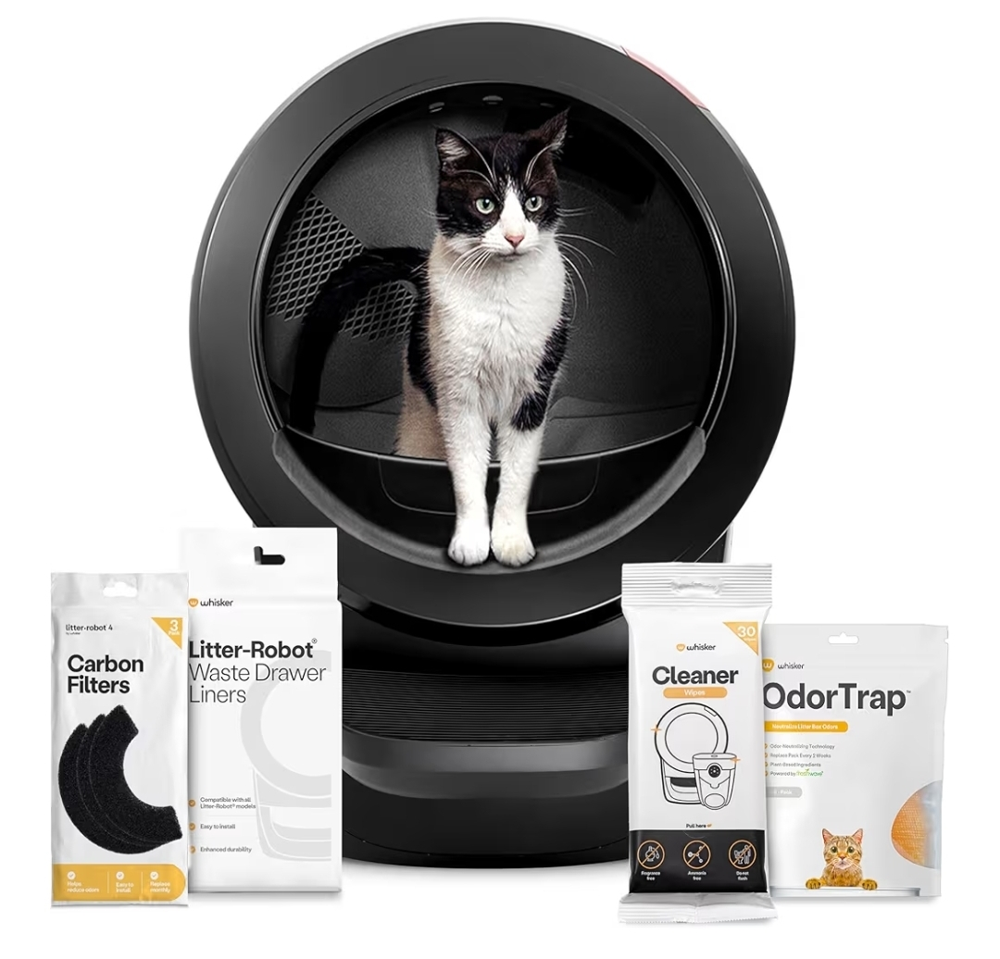
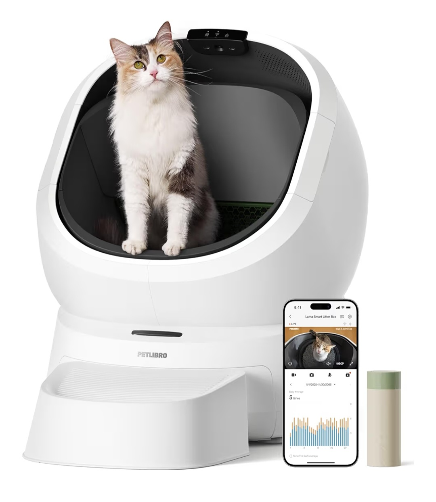
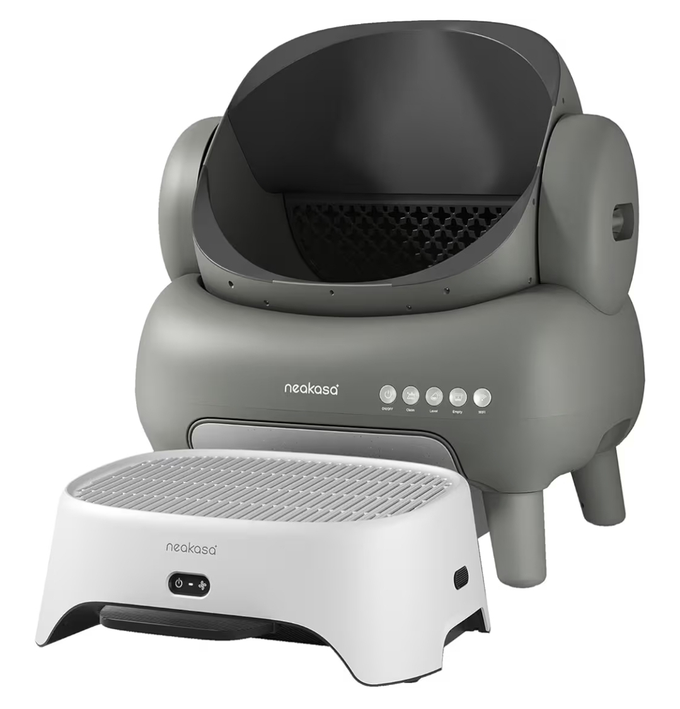
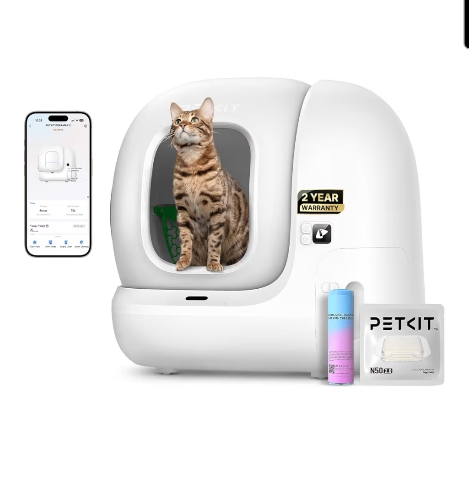
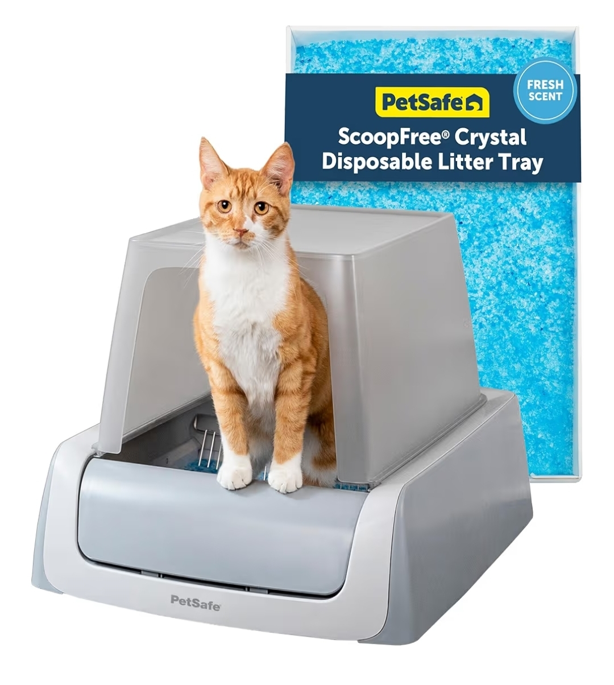

If you've ever stood over a litter box at 6 a.m. wondering whether *this* is really what you signed up for, you're in the right place. Self-cleaning litter boxes have come a long way from the clunky rakes of the early 2000s — the 2026 generation uses weight sensors, infrared arrays, and AI cameras that literally analyze your cat's waste for early warning signs of kidney disease and UTIs.

But they're also expensive. The wrong pick is a $500 paperweight your cat refuses to use. So we pulled together the five models that consistently earn the highest marks from both reviewers and actual long-term owners, and ranked them by what they're genuinely best at — not just which brand paid the most for placement.

## Our top 5 self-cleaning litter boxes of 2026

### 1. Litter-Robot 4 by Whisker — Best Overall ($699)

The industry benchmark, and the one most reviewers still rank first. Whisker has been making self-cleaning litter boxes for over 20 years, and the Litter-Robot 4 is the result of that runway. Its patented globe-sifting mechanism quietly rotates after your cat exits, dropping clumps into a sealed carbon-filtered drawer below while clean litter cycles back into the bed. The Whisker app tracks weight trends, litter levels, and visit frequency per cat — genuinely useful data if you've got multiple cats and one starts peeing more than usual.

**Specs at a glance:**
- Cat weight range: 3 to 20 pounds
- Cats supported: up to 4
- Litter type: clumping
- Warranty: 1 year (extendable)

**What we loved:** Quietest cycle of any premium box we tested. App tracks per-cat weight, which spots health issues early. Sealed waste drawer genuinely contains odor. 90-day money-back guarantee.

**Worth knowing:** Expensive by a wide margin. Large footprint at 22 inches wide by 27 inches deep by 29 inches tall. Tall step-in may challenge senior cats.

<a href="https://www.amazon.com/dp/B0FFDNZSHT?th=1&linkCode=ll1&tag=bizco057-20&language=en_US&ref_=as_li_ss_tl" class="btn btn-cta" target="_blank" rel="sponsored noopener">Check Price on Amazon →</a>

*Price starts from $699 and is subject to change. This link also works for shoppers in Canada, France, Germany, Italy, the Netherlands, Poland, Spain, Sweden, and the United Kingdom.*

---

### 2. PETLIBRO Luma Smart Litter Box — Best for Health Monitoring ($599)

The only box on this list with an AI camera that actually analyzes your cat's waste. Released in late 2025, the Luma is the newcomer that's making older models look dated. Its onboard AI camera can distinguish urine from solid waste, detect whether stool is loose or solid, and recognize up to 10 individual cats by appearance. When your app pings you that "Mochi hasn't used the box in 22 hours," you know exactly who needs attention. The open-top design accommodates cats up to 22 pounds, and the built-in carbon-filter fan traps 97 percent of odors according to third-party lab testing.

**Specs at a glance:**
- Cat weight range: 2.2 to 22 pounds
- Cats recognized: up to 10
- Waste capacity: 7 days for 2 cats
- Warranty: 2 years

**What we loved:** AI waste analysis genuinely catches issues most owners would miss. Multi-cat recognition works even from partial angles. Open top preferred by most cats. Generous 2-year warranty.

**Worth knowing:** Full AI analysis requires a paid cloud subscription. Must sit on a hard flat surface, not carpet. No SD card option for recordings.

<a href="https://www.amazon.com/dp/B0G599SG3B?th=1&linkCode=ll1&tag=bizco057-20&language=en_US&ref_=as_li_ss_tl" class="btn btn-cta" target="_blank" rel="sponsored noopener">Check Price on Amazon →</a>

*Price starts from $599 and is subject to change. This link also works for shoppers in Canada, France, Germany, Italy, the Netherlands, Poland, Spain, Sweden, and the United Kingdom.*

---

### 3. Neakasa M1 Plus Open-Top — Best Open-Top Design ($499)

For cats who refuse anything with a roof, including 33-pound Maine Coons. Most self-cleaning boxes are enclosed globes, which is great for odor control and terrible for cats who feel claustrophobic. The Neakasa M1 Plus solves that with a genuine open-top drum design that cleans by rotating downward — no roof, no cramped entry. It supports cats up to 33 pounds, which is unusually generous, and the 2026 "Plus" update adds a 6-sensor rotary infrared array that catches cats the original M1 occasionally missed. At $499 it sits in premium territory but undercuts the Litter-Robot 4 meaningfully.

**Specs at a glance:**
- Cat weight range: 2.2 to 33 pounds
- Waste bin: 11.2 liters
- Maintenance interval: 7 to 14 days
- Noise level: approximately 35 dB (very quiet)

**What we loved:** Highest weight capacity on this list at 33 pounds. Open top eases transition for skeptical cats. Bundle with AirStep air purifier is included at no extra cost. Pull-and-wrap waste system is genuinely mess-free.

**Worth knowing:** Some reports of urine leaks in the older M1 model — the Plus version addresses this. Open design means slightly more odor escapes. Only pairs with 2.4 GHz Wi-Fi, not 5 GHz.

<a href="https://www.amazon.com/dp/B0GD69KW7J?th=1&linkCode=ll1&tag=bizco057-20&language=en_US&ref_=as_li_ss_tl" class="btn btn-cta" target="_blank" rel="sponsored noopener">Check Price on Amazon →</a>

*Price starts from $499 and is subject to change. This link also works for shoppers in Canada, France, Germany, Italy, the Netherlands, Poland, Spain, Sweden, and the United Kingdom.*

---

### 4. PETKIT PuraMax 2 — Best for Small Spaces ($399)

A smart box that actually fits in a one-bedroom apartment. If you've ever tried to fit a Litter-Robot into a Brooklyn bathroom, you know the struggle. The PETKIT PuraMax 2 packs a 76-liter interior into a footprint meaningfully smaller than its premium rivals, with a low 7.87-inch entry that senior cats and short-legged breeds like Munchkins can handle without a step. It's also one of the only boxes in this bracket that ships with an anti-leakage ShieldBase — a legitimate fix for the urine-seepage issue that plagues cheaper models. The 7-liter waste bin supports about 15 days between emptyings for a single cat.

**Specs at a glance:**
- Cat weight range: 3.3 to 22 pounds
- Entry height: 7.87 inches (low)
- Interior volume: 76 liters
- Sensors: 7 infrared plus 4 weight

**What we loved:** Smallest premium footprint we tested. Low entry friendly to senior and short-legged cats. New seal design fixes urine-leak complaints from earlier generations. Works with tofu, clay, and bentonite litters.

**Worth knowing:** Assembly required out of the box. Do not place on carpet or a soft mat. Not recommended for kittens under 6 months.

<a href="https://www.amazon.com/dp/B0DFYF2D7D?th=1&linkCode=ll1&tag=bizco057-20&language=en_US&ref_=as_li_ss_tl" class="btn btn-cta" target="_blank" rel="sponsored noopener">Check Price on Amazon →</a>

*Price starts from $399 and is subject to change. This link also works for shoppers in Canada, France, Germany, Italy, the Netherlands, Poland, Spain, Sweden, and the United Kingdom.*

---

### 5. PetSafe ScoopFree Crystal Pro — Best Budget ($179)

Proven, simple, and a fraction of the price of the app-connected boxes. Not everyone needs AI cameras and Wi-Fi. The PetSafe ScoopFree has been around long enough to rack up nearly 25,000 Amazon reviews at a 4.2-star average, and it still works exactly as advertised. It uses disposable crystal litter trays instead of clumping clay, which absorbs urine and dehydrates solids to neutralize odor. PetSafe claims 5 times better odor control than traditional clumping. A single tray lasts about 30 days in a single-cat home, and swap-out takes 30 seconds. The built-in health counter tracks visit frequency as a rough health-change signal.

**Specs at a glance:**
- Cat weight range: up to 15 pounds
- Tray life: approximately 30 days for 1 cat
- Litter type: proprietary crystal
- Setup time: under 5 minutes

**What we loved:** Cheapest entry point into automatic litter. Proven design with over 25 years of refinement. No assembly, no app, no learning curve. Crystal litter controls odor better than standard clay.

**Worth knowing:** Ongoing cost of disposable trays runs approximately $20 to $25 each. You're locked into PetSafe's crystal litter ecosystem. No app control or data tracking.

<a href="https://www.amazon.com/dp/B07X3XFB6K?th=1&linkCode=ll1&tag=bizco057-20&language=en_US&ref_=as_li_ss_tl" class="btn btn-cta" target="_blank" rel="sponsored noopener">Check Price on Amazon →</a>

*Price starts from $179 and is subject to change. This link also works for shoppers in Canada, France, Germany, Italy, the Netherlands, Poland, Spain, Sweden, and the United Kingdom.*

---

## The real reason cat parents switch to automatic

In informal surveys of self-cleaning litter box owners, the most cited reason for upgrading isn't odor, aesthetics, or tech features — it's reclaiming the morning routine. Your time is the product. Keep that in mind as you weigh $180 versus $700: you're buying back minutes of your day, every day, for the next 5 to 10 years. Spread over that time horizon, even the premium boxes work out to pennies per day of reclaimed time, and that calculation changes how the price tags feel.

## How to choose the right box for your situation

### Size your cat honestly

The "up to 15 pounds" cutoff on many mid-range boxes is where most owners hit trouble. If you have a Maine Coon, Ragdoll, or any cat flirting with 18 pounds or more, the Neakasa M1 Plus with its 33-pound capacity or the PETLIBRO Luma at 22 pounds with open-top design are your only real options. An undersized box leads to accidents beside the box, not inside it.

### Budget realistically for ongoing costs

A $179 ScoopFree looks cheap until you add $20 crystal trays every month — that's $240 a year in ongoing supplies. A $699 Litter-Robot uses regular clumping litter from any grocery store. Over a 5-year ownership window, the total cost difference narrows considerably. Before committing to any box, calculate the all-in five-year cost including proprietary accessories, filters, and trays.

### Measure your space before you buy

The Litter-Robot 4 needs a 22-inch by 27-inch footprint *plus* 2 inches of clearance on all sides — it literally cannot touch walls without risking operational issues. If your laundry nook is 24 inches wide, the PuraMax 2 or ScoopFree will fit, but the Litter-Robot won't. Measure twice before ordering.

### Respect the transition period

Even the best automatic box takes 1 to 3 weeks for most cats to accept. Keep your old box in the same room for the first two weeks, and never force the transition. Cats who panic-eliminate outside the box because of automatic movement can develop lifelong aversions that are harder to fix than they were to prevent.

## Our bottom line

If budget is no object and you want the best-engineered option, the Litter-Robot 4 is still the benchmark. For most cat parents, though, the Neakasa M1 Plus or PETKIT PuraMax 2 deliver 85 percent of the experience at 60 percent of the price. And if you just want to stop scooping tomorrow without overthinking it, the PetSafe ScoopFree has been doing the job reliably for 25 years.

## Frequently asked questions

**Are self-cleaning litter boxes safe for cats?** The premium models on this list — the Litter-Robot 4, PETLIBRO Luma, Neakasa M1 Plus, and PETKIT PuraMax 2 — all use weight sensors and infrared arrays that pause the cleaning cycle the moment a cat is detected. They're generally safer than owners assume. The documented incidents of injury involve older, cheaper models without redundant sensors. That said, all manufacturers recommend disabling auto-clean for kittens under 6 months.

**How long does it take for a cat to adjust?** Most cats take 1 to 3 weeks to fully accept a new self-cleaning box. The trick is patience. Place the new box next to the existing one, don't clean the old box for a day or two so the new one smells familiar when you transfer used litter, and never activate the cleaning cycle while your cat is watching for the first week.

**Do they really eliminate odor?** The sealed-waste-drawer models, like the Litter-Robot 4 and PETLIBRO Luma, handle odor significantly better than a standard scooped box because waste is isolated within minutes rather than sitting for hours. Open-top models like the Neakasa let slightly more smell escape but offset this with active carbon filtration. The biggest odor variable isn't actually the box — it's how often you empty the waste drawer.

**Can one self-cleaning box serve multiple cats?** Technically yes, but the traditional "one box per cat plus one extra" rule still applies for behavioral reasons, not just logistics. Cats are territorial about bathrooms. In a two-cat household, one premium self-cleaning box often works, but three or more cats generally need at least two boxes.

**What litter works best with these boxes?** All four of the premium picks require fast-clumping litter. Avoid slow-clumping, paper, pine, or walnut varieties with these boxes. The PetSafe ScoopFree is the exception because it only works with PetSafe's proprietary crystal trays. For the premium boxes, bentonite clay with medium-sized particles is the safest default across most brands.
